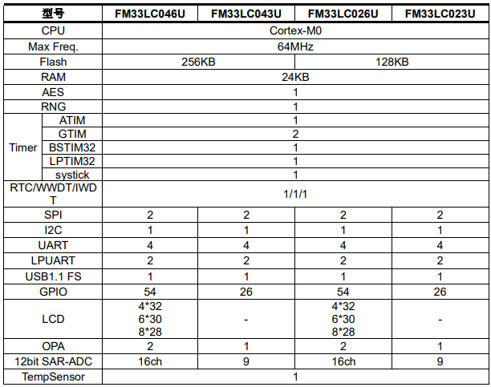

# [FM33LC0](https://github.com/SoCXin/FM33LC0)

#### [Vendor](https://github.com/SoCXin/Vendor)：[FM](http://www.fmsh.com/)
#### [Core](https://github.com/SoCXin/Cortex)：[Cortex M0](https://github.com/SoCXin/CM0)
#### [Level](https://github.com/SoCXin/Level)：64MHz

## [描述](https://github.com/SoCXin/FM33LC0/wiki)

[FM33LC0](https://github.com/SoCXin/FM33LC0)基于ARM Cortex-M0内核，集成大容量嵌入式闪存，具备丰富的模
拟和数字外设，并具有优异的低功耗特性。FM33LC0xxx系列包含两个子系列，分别为支持无晶振USB FS device的FM33LC0xxU系列，和不支持USB的FM33LC0xxN系列(1.8V~3.6V)，以及FM33LC0x4NR系列(1.8V~5.5V)。

##### 关键特性

* 支持无晶振USB FS device

### [资源收录](https://github.com/SoCXin/FM33LC0)

* [参考文档](docs/)
* [参考资源](src/)
* [参考工程](project/)

### [选型建议](https://github.com/SoCXin)

[FM33LC0](https://github.com/SoCXin/FM33LC0)
###  [www.SoC.xin(芯)](http://www.SoC.Xin)
