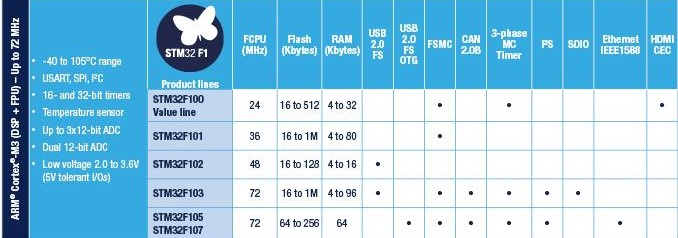

# [STM32F1](https://github.com/sochub/STM32F1) 

 

#### 归属：[cortex M3](https://github.com/sochub/CM3)

## [描述](https://github.com/sochub/STM32F1/wiki) 

在某种程度上，[STM32F1](https://www.st.com/zh/microcontrollers-microprocessors/stm32f1-series.html?querycriteria=productId=SS1031) 是开发资源最丰富的单片机，一般都是被国内外各种开源项目优先支持。

## [组成](SoC/) 

#### [文档资料](docs/)

参考设计和数据手册

#### [项目文件](project/)

包括各种开发资源和工程

##### [相似产品](https://github.com/sochub/GD32)

---

###  [SoC开发平台](http://www.qitas.cn)   

###  qitas@qitas.cn